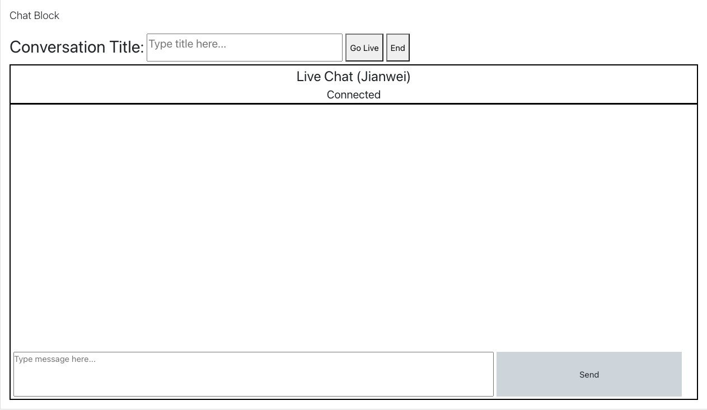

<!-- ABOUT THE PROJECT -->
# Moodle Chat
Test functionality of Twilio integration with Moodle<br/>
Location: /blocks/chat



## Things to do:
* Setup Twilio Account
* Setup environment variables
* Admin just for chat manager
    * is_siteadmin() generic or can there be tiers?
* Add extra field for user as identity for participant
    * first 3 chars of email, duplicates add number behind
* Create mysql tables
* Explore if during participant creation, add roles such that javascript can handle deletion instead of having to pass back to backend

## Things to take note of:
* Admin when creating, have to click "Go Live" before chat can go live
    * if admin does not click "end", chat will remain live.
* Database name when creating
* Generation of Token for Twilio access
    * Duration of the token (1hour/2hour/3hour)
        * Do you want to refresh
    * Identity of the participant


## Set up environmental variables
* TWILIO_ACCOUNT_SID 
* TWILIO_AUTH_TOKEN
* TWILIO_API_KEY
* TWILIO_API_SECRET
* SERVICE_SID

## mysql commands
* Create table for block_chat plugin
    * id
    * activity: current [can be removed cause I added id to the table]
    * live: whether chat is live
    * conversation: when the admin goes live, the conversation id will be stored here
```
CREATE TABLE mdl_block_chat (
    id bigint(10) NOT NULL AUTO_INCREMENT,
    activity varchar(255) NOT NULL,
    live boolean,
    conversation varchar(255),
    PRIMARY KEY(id)
);
```
* Update values when chat is live or end with the conversation id
```
$table = 'block_chat';
$dataobject = [
    'id'   => 1,
    'live' => 0,
    'conv' => ""
];
$DB->update_record($table, $dataobject, $bulk=false);
```
* Create table for blocked participants
    * id
    * identity in twilio
```
CREATE TABLE mdl_block_participants (
    id bigint(10) NOT NULL AUTO_INCREMENT,
    identity varchar(255),
    PRIMARY KEY(id)
);
```

## Documentations used:
* https://docs.moodle.org/dev/Javascript_Modules
    * nvm install v14.15.0
    * nvm alias default v14.15.0
    * npm install
    * npm install -g grunt-cli
* https://www.twilio.com/docs/libraries/php
    * https://getcomposer.org/doc/00-intro.md
        * see download page > guide on installing composer programmatically
    * php composer.phar require twilio/sdk
* https://media.twiliocdn.com/sdk/js/conversations/releases/1.1.0/docs/Client.html
<!-- * https://gist.github.com/yehgdotnet/fd9b86a08c5e0c03fa57ad3ae8217892 -->

## mysqldump
./mysqldump -u root -p moodle > /Applications/MAMP/htdocs/moodle/exported_db.sql
password: root