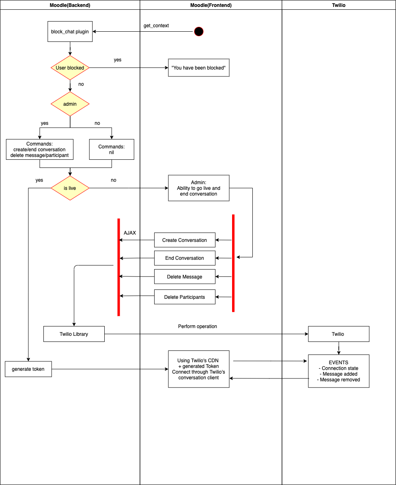

<!-- ABOUT THE PROJECT -->
# Moodle Chat
Test functionality of Twilio integration with Moodle

## Documentations used:
* https://docs.moodle.org/dev/Javascript_Modules
    * nvm install v14.15.0
    * nvm alias default v14.15.0
    * npm install
    * npm install -g grunt-cli
* https://www.twilio.com/docs/libraries/php
    * https://getcomposer.org/doc/00-intro.md
        * see download page > guide on installing composer programmatically
    * php composer.phar require twilio/sdk
<!-- * https://gist.github.com/yehgdotnet/fd9b86a08c5e0c03fa57ad3ae8217892 -->

## Set up environmental variables
* TWILIO_ACCOUNT_SID 
* TWILIO_AUTH_TOKEN
* TWILIO_API_KEY
* TWILIO_API_SECRET
* SERVICE_SID

## mysql commands
CREATE TABLE mdl_block_chat (
    id bigint(10) NOT NULL AUTO_INCREMENT,
    activity varchar(255) NOT NULL,
    live boolean,
    conversation varchar(255),
    PRIMARY KEY(id)
);

INSERT INTO mdl_block_chat (activity, live)
VALUES ("current", false);

CREATE TABLE mdl_block_participants (
    id bigint(10) NOT NULL AUTO_INCREMENT,
    identity varchar(255),
    PRIMARY KEY(id)
);
## mysqldump
./mysqldump -u root -p moodle > /Applications/MAMP/htdocs/moodle/exported_db.sql
password: root